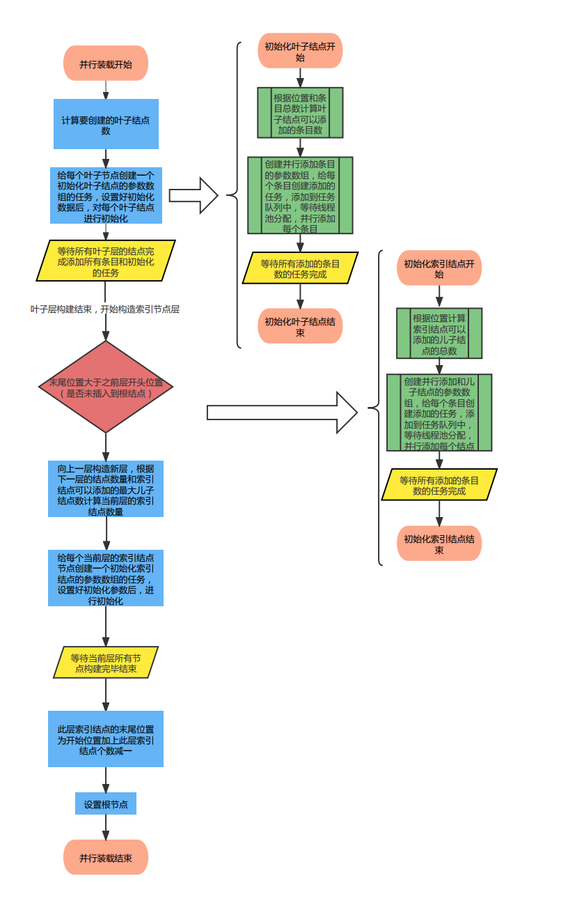
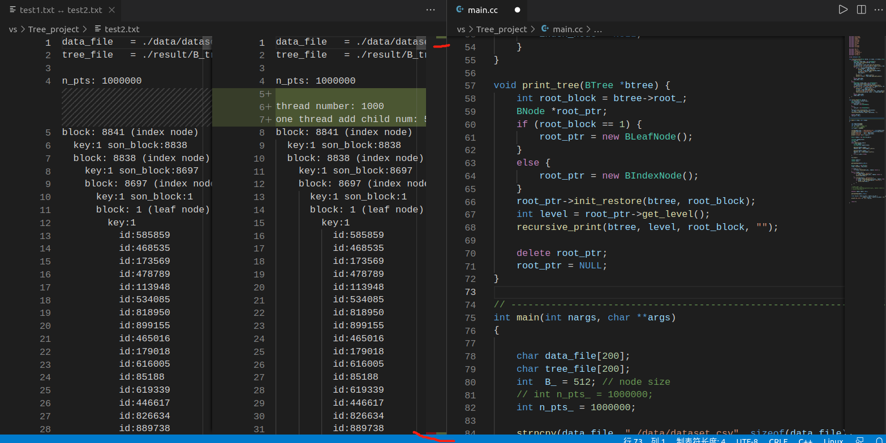
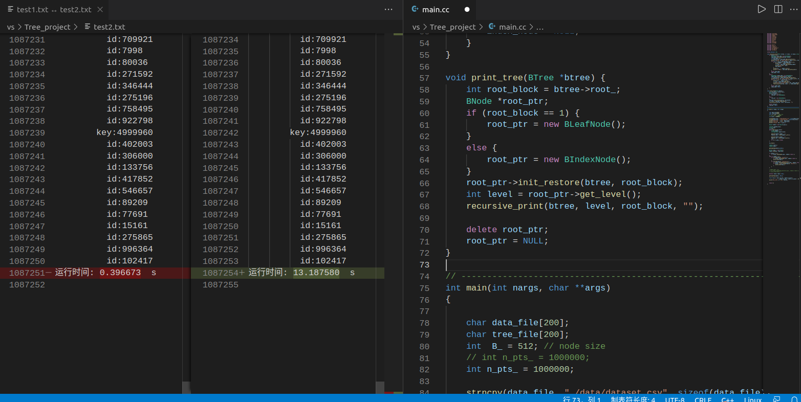

# 课程设计报告

## B+树bulkloading过程的理解

**1. B+树bulkloading过程的准备阶段：**

在main函数中首先执行程序，所以先看main函数，首先声明节点大小`B_`为`512`，存储指向节点的指针个数`n_pts_`为`1000000`，然后将读取数据文件和B+树存储数据文件的文件名复制到`data_file`和`tree_file`字符串数组中，并将文件名打印出来，申请一个名为`table`的`Result`类型数组，数组大小为`n_pts_`，读入数据文件`data_file`的文件流到文件指针`fp`中，然后读入每行数据文件`data_file`中的数据到`string`类型变量`line`中，每一行`i`的两个数据以逗号分隔，第一个数据读到`table`数组相应下标`i`的`key_`里，代表关键字，第二个数据读到`table`数组相应下标的`id_`里，代表指向节点的指针，关闭文件流，开始计时，首先创建一个B+树`trees_`，并对其进行初始化，然后对其进行bulkloading过程，打印这个过程的时间，程序结束。

**2. B+树bulkloading过程使用的函数：**

```C++
int BTree::bulkload(int n, const Result *table)
```

B+树bolkloading会调用一个名为`int bulkload(int n, const Result *table)`的函数进行加载，这个函数在`b_tree.cc`中定义，参数`n`是要加载的条目entries数，参数`table`是一个哈希表，存储了这`n`个条目的相关信息，大小也为n，每个条目与每个哈希表的下标一一对应，哈希表的关键字是`key_`，值是一个指向子结点的指针`id_`，通过这个哈希表，可以快速找到要加载的条目对应的指针。

**2.1 首先声明变量：**

```C++
BIndexNode *index_child   = NULL;
BIndexNode *index_prev_nd = NULL;
BIndexNode *index_act_nd  = NULL;
BLeafNode  *leaf_child    = NULL;
BLeafNode  *leaf_prev_nd  = NULL;
BLeafNode  *leaf_act_nd   = NULL;

int   id    = -1;
int   block = -1;
float key   = MINREAL;

bool first_node  = true;
int  start_block = 0;
int  end_block   = 0;
```

函数一开始时，首先声明了几个变量：
+ 三个`BIndexNode *`类的索引结点指针：
  + `index_child`指向索引结点的子结点，这个子结点也是索引结点
  + `index_prev_nd`指向前一个条目插入满的索引结点
  + `index_act_nd`指向当前正在进行插入条目的索引结点
+ 声明了三个`BLeafNode *`叶子结点指针
  + `leaf_child`指向第1层索引结点（叶子结点层数为0）的子结点，这个子结点是叶子结点
  + `leaf_prev_nd`指向上一个插入满的叶子结点
  + `leaf_act_nd`指向当前正在进行插入的叶子结点。
+ 声明整型变量`id`和浮点型变量`key`存储遍历哈希表`table`时每个`id_`和`key_`的值
+ 声明布尔类型变量`first_node`判断当前结点是否是当前层的第一个结点
+ 声明整型变量`start_block`和`end_block`存储B+树每一层的第一个结点和最后一个结点的位置，叶子结点的block从1开始，依次加一往后
+ 声明整型变量`block`存储从每一层的第一个结点位置`start_block`到最后一个结点的位置`end_block`进行遍历时每一个结点的位置

**2.2 接着先从底层叶子节点构建，从左往右按顺序构建一个双向链表：**

```C++
for (int i = 0; i < n; ++i) {
    id  = table[i].id_;
    key = table[i].key_;

    if (!leaf_act_nd) {
        leaf_act_nd = new BLeafNode();
        leaf_act_nd->init(0, this);

        if (first_node) {
            first_node  = false; // init <start_block>
            start_block = leaf_act_nd->get_block();
        }
        else {					// label sibling
            leaf_act_nd->set_left_sibling(leaf_prev_nd->get_block());
            leaf_prev_nd->set_right_sibling(leaf_act_nd->get_block());

            delete leaf_prev_nd; leaf_prev_nd = NULL;
        }
        end_block = leaf_act_nd->get_block();
    }							
    leaf_act_nd->add_new_child(id, key); // add new entry

    if (leaf_act_nd->isFull()) {// change next node to store entries
        leaf_prev_nd = leaf_act_nd;
        leaf_act_nd  = NULL;
    }
}
if (leaf_prev_nd != NULL) {
    delete leaf_prev_nd; leaf_prev_nd = NULL;
}
if (leaf_act_nd != NULL) {
    delete leaf_act_nd; leaf_act_nd = NULL;
}
```

+ 先从底层叶子节点构建，从左往右按顺序构建一个双向链表，遍历哈希表`table`：
  + 在每次遍历中，将哈希表中每一项的`id_`和`key_`值记录在整型变量`id`和`key`中，代表要加载每一项的指向子节点的指针和关键字。判断此时指向当前正在进行插入的叶子结点`leaf_act_nd`是否为空：
    + 如果为空，那么要创建一个新的叶子结点`leaf_act_nd`，并使用它的初始化方法`init(0, this)`初始化这个叶子结点，设置这个结点所处层数为0，所在B+树为当前调用这个操作的B+树：
      + 在叶子结点的初始化方法`void init(int level, BTree *btree)`中，首先根据传入参数设置所在层数和B+树，设置结点中保存的条目数`num_entries_`和关键字数`num_keys_`为0，左兄弟和右兄弟所处在的`block`位置为-1，设置脏块`dirty_`为true，表示要写回文件。
      + 然后调用`btree_->file_->get_blocklength()`获取block块的长度到`b_length`，调用语句`get_key_size(b_length)`计算block块的长度`b_length`除以叶子结点大小`LEAF_NODE_SIZE`并向下取整赋给最大可以存储的关键字数`capacity_keys_`，经过计算后得到关键字的大小到`key_size`中。
      + 接着为结点的关键字浮点型指针`key_`申请一个大小为关键字最大容量`capacity_keys_`的浮点型数组并将其中元素都初始化为`MINREAL`，获取结点的头部大小`header_size`和条目大小`entry_size`，根据这两个值以及block块的长度`b_length`和关键字的大小`key_size`计算出这个结点可以包含的条目的最大容量`capacity_`，小于100则报错退出，否则为结点的对象id整型指针`id_`申请一个大小为`capacity_`的整型数组并将其中元素都初始化为-1。
      + 最后为字符型指针`blk`申请一个大小为block块的长度`b_length`的字符型数组，使用语句`btree_->file_->append_block(blk)`添加一个新块`block`到文件末尾，并设置结点所处块的序号。
        + 在`int append_block(Block block)`方法中，首先使用语句`fseek(fp_, 0, SEEK_END)`使BlockFile的文件指针`fp_`指向存储文件的末尾。
        + 然后使用语句`put_bytes(block, block_length_)`将这个`block`中的内容写入文件指针`fp_`指向的存储文件，并且文件中`block`的数目`num_blocks_`加一。
        + 接着使用语句`fseek(fp_, SIZEINT, SEEK_SET)`使BlockFile的文件指针`fp_`指向存储文件的开头后4个字节文件头部的位置，使用语句`fwrite_number(num_blocks_)`将更新后的`block`的数目`num_blocks_`写入文件中。
        + 最后使用语句`fseek(fp_, -block_length_, SEEK_END)`使文件指针`fp_`指向的存储文件加入的新块，设置文件指针指向的块的序号`act_block_`为`num_blocks_`并返回`act_block_ - 1`。
    + 接着判断这个叶子结点是否是它所在这一层的第一个结点`first_node`：
      + 如果是，则标记起始点的位置`start_block`为这一个结点的位置，并把`first_node`置为`false`，使之后的叶子结点都不是第一个叶子结点
      + 如果不是，那么标记当前插入的叶子结点的左兄弟的`block`位置为上一个插入满的叶子结点的`block`位置，上一个插入满的叶子结点的右兄弟的`block`位置为当前插入的叶子结点的`block`位置，形成一个双向链表。删除指向上一个插入满的叶子结点的指针`leaf_prev_nd`，此时调用析构函数将结点的信息写入文件相应的`block`位置中。 
    + 标记最后一个结点的位置`end_block`为当前正在进行插入的叶子结点的位置
  + 当前插入的叶子结点`leaf_act_nd`不为空后，使用语句`leaf_act_nd->add_new_child(id, key)`插入指针为`id`，关键字为`key`的条目到当前正在执行插入操作的结点`leaf_act_nd`中，插入完成后，如果当前插入的叶子结点已经满了，那标记当前插入的叶子结点为上一个插入的结点，当前插入的叶子结点为空，以便之后可以创建新的结点插入新的条目。遍历完成，哈希表`table`中所有的条目都被加到了叶子结点中。
  + 删除指向上一个插入满的叶子结点的指针`leaf_prev_nd`和当前正在进行插入的叶子结点`leaf_act_nd`，此时调用析构函数将结点的信息写入文件相应的`block`位置中。 

**2.3 然后从下往上，一层层构建索引节点，每一层也是从左往右构建索引节点：**

```C++
int current_level    = 1;		// current level (leaf level is 0)
int last_start_block = start_block;	// build b-tree level by level
int last_end_block   = end_block;	// build b-tree level by level

while (last_end_block > last_start_block) {
    first_node = true;
    for (int i = last_start_block; i <= last_end_block; ++i) {
        block = i;				// get <block>
        if (current_level == 1) {
            leaf_child = new BLeafNode();
            leaf_child->init_restore(this, block);
            key = leaf_child->get_key_of_node();

            delete leaf_child; leaf_child = NULL;
        }
        else {
            index_child = new BIndexNode();
            index_child->init_restore(this, block);
            key = index_child->get_key_of_node();

            delete index_child; index_child = NULL;
        }

        if (!index_act_nd) {
            index_act_nd = new BIndexNode();
            index_act_nd->init(current_level, this);

            if (first_node) {
                first_node = false;
                start_block = index_act_nd->get_block();
            }
            else {
                index_act_nd->set_left_sibling(index_prev_nd->get_block());
                index_prev_nd->set_right_sibling(index_act_nd->get_block());

                delete index_prev_nd; index_prev_nd = NULL;
            }
            end_block = index_act_nd->get_block();
        }						
        index_act_nd->add_new_child(key, block); // add new entry

        if (index_act_nd->isFull()) {
            index_prev_nd = index_act_nd;
            index_act_nd = NULL;
        }
    }
    if (index_prev_nd != NULL) {// release the space
        delete index_prev_nd; index_prev_nd = NULL;
    }
    if (index_act_nd != NULL) {
        delete index_act_nd; index_act_nd = NULL;
    }
    
    last_start_block = start_block;// update info
    last_end_block = end_block;	// build b-tree of higher level
    ++current_level;
}
root_ = last_start_block;		// update the <root>
```

**首先进行声明：**

+ 以叶子所在层为第0层，从下往上，声明当前结点所处树的层`current_level`为1
+ 之前层开始的位置`last_start_block`为上面第一个叶子结点的位置`start_block`
+ 之前层结束的位置`last_end_block`为上面最后一个叶子结点的位置`end_block`

**然后按照每一层从左往右、从下往上构建索引结点，直到根结点：**

+ 然后当之前层结束的位置`last_end_block`大于之前层开始的位置`last_start_block`时，说明还没有插入到根结点（`last_start_block == last_end_block`），进入一个while循环，每次循环，从下往上构建每一层的索引结点：
  + 首先使此层第一个点`first_node`为true，从上一个开始的位置`last_start_block`开始，到上一个结束的位置`last_end_block`结束，进入一个for循环，使`block`为当前位置
    + 如果当前所处层`current_level`为1，说明正在构建第1层的索引结点，其每个儿子结点都是叶子结点，那么创建一个新的叶子结点`leaf_child`，这个叶子结点是构建的索引结点的儿子结点，调用这个叶子结点的`init_restore(this, block)`方法加载处于`block`位置的之前存储的叶子结点的信息，并获取这个结点的关键字并赋值给`key`。删除叶子结点`leaf_child`，此时调用析构函数将结点的信息写入文件相应的`block`位置中。
    + 如果当前所处层`current_level`大于1，说明正在构建的索引结点，其每个儿子结点也全都是索引结点，那么创建一个新的索引结点`index_child`，这个索引结点是构建的索引结点的儿子结点，调用这个结点的`init_restore(this, block)`方法加载这个处于`block`位置的之前存储的结点的信息，并获取这个结点的关键字并赋值给`key`。删除索引结点`index_child`，此时调用析构函数将结点的信息写入文件相应的`block`位置中。 
    + 判断此时正在进行插入操作的索引结点`index_act_nd`是否为空：
      + 如果为空，那么要创建一个新的索引结点`index_act_nd`，并使用它的初始化方法`init(current_level, this)`初始化这个索引结点，设置这个结点所处的层数和所在B+树，接着判断这个索引结点是否是它所在这一层的第一个结点`first_node`：
        + 如果是，则标记此层起始点的位置`start_block`为这一个结点的位置，并把`first_node`置为`false`，使之后的索引结点都不是第一个索引结点
        + 如果不是，那么标记当前正在插入的索引结点`index_act_nd`的左兄弟为上一个插入满的索引结点`index_prev_nd`，上一个插入满的索引结点`index_prev_nd`的右兄弟为当前正在插入的索引结点`index_act_nd`，形成一个双向链表。标记最后一个结点的位置`end_block`为正在进行插入的索引结点的位置
    + 当前正在插入的索引结点`index_act_nd`不为空后，使用语句`index_act_nd->add_new_child(key, block)`把关键字为`key`，位置为`block`的儿子结点插入进这个索引结点中，插入完成后，如果当前插入的索引结点已经满了，那标记当前插入的索引结点为上一个插入的结点，当前插入的索引结点为空，以便之后可以创建新的结点插入新的条目。遍历完成，这一层的索引结点就构建完成。
  + 当前层插入完成之后，更新之前层开始的位置`last_start_block`为插入完成后的当前层的开始位置`start_block`，之前层结束的位置`last_end_block`为当前层的位置`end_block`，层数加一，代表往上一层。
+ 全部插入完成之后，更新根结点`root_`为上一个开始的位置`last_start_block`，删除所用到的结点指针，此时调用析构函数将结点的信息写入文件相应的`block`位置中，bulkloading加载过程完成。

## 算法并行的设计思路

从上面串行bulkloading过程可以知道，首先从最底层叶子结点开始，从左往右初始化叶子结点并构建双向链表，然后从下往上，逐层从左往右初始化索引结点并构建双向链表，直到根结点，程序结束。

那么并行设计算法，就可以通过对每一层结点的位置和相应存储信息进行计算，得到每一个结点需要添加的条目或儿子结点的信息，从而每一层的每个结点都可以并行地添加数据，从而提高程序运行效率。

叶子结点所添加的是条目，索引结点添加的是关键字和儿子结点的位置，分别需要使用不同的添加函数和初始化函数，由于叶子结点在最底层，所以可以将程序分为两个部分，先开始向叶子结点并行添加数据，叶子结点全部构建完成之后，再每层向上并行向索引结点添加数据。

对每一层进行并行添加数据，从下往上，下面一层构建完成后，再向上一层的结点并行添加数据，直到根结点，程序结束。

## 算法流程图



## 关键代码描述

### 1. 初始化结点

每个结点都需要根据所处层调用init方法进行初始化，在初始化方法中，需要完成确定结点的block位置(使用init方法)、设置结点的信息数据和添加条目或儿子结点的任务，对于叶子结点和索引结点，初始化方法有所不同，可以分成两个函数进行实现。

**初始化叶子结点：**

```cpp
// 初始化叶子结点所使用的参数结构体
struct Init_Leaf_Node_Params {
    BLeafNode *first_leaf_node;       // 叶子结点层的第一个结点，如果这个初始化的叶子结点不是第一个结点，这个参数为NULL
    BTree *btree;                     // 叶子结点所在B+树
    int n;                            // 总的条目个数
    const Result *table;              // 存储条目信息的哈希表
    int leaf_node_capacity_entries;   // 叶子结点可以存储的最大条目数
    int leaf_node_capacity_keys;      // 叶子结点可以存储的最大关键字数
    int leaf_node_num;                // 叶子结点的总数
};

// 初始化叶子结点
static void init_the_leaf_node(void *arg) {
    // 获取参数
    Init_Leaf_Node_Params *init_params = (Init_Leaf_Node_Params *)arg;

    BLeafNode *first_leaf_node = init_params->first_leaf_node;
    BTree *btree = init_params->btree;
    int n = init_params->n;
    const Result *table = init_params->table;
    int leaf_node_capacity_entries = init_params->leaf_node_capacity_entries;
    int leaf_node_capacity_keys = init_params->leaf_node_capacity_keys;
    int leaf_node_num = init_params->leaf_node_num;

    int i, ret;

    // 声明初始化的叶子结点
    BLeafNode *leaf_node;
    // 如果作为参数传递进来的first_leaf_node为空
    if (first_leaf_node == NULL) {
        // 说明初始化的这个结点不是该层的第一个结点，调用init方法进行初始化
        leaf_node = new BLeafNode();
        // 调用init方法时，会改变block的位置序号，每次调用位置block加一，所以要加锁
        leaf_node->init(0, btree);
    }
    // first_leaf_node不为空说明是第一个结点，直接获取结点
    else {
        leaf_node = first_leaf_node;
    }

    // 获取结点位置
    int block = leaf_node->get_block();

    // 向叶子结点添加条目在哈希表中的起始位置
    int start_pos = (block - 1) * leaf_node_capacity_entries;
    // 向叶子结点添加条目在哈希表中的终点位置
    int end_pos = start_pos + leaf_node_capacity_entries;
    // 如果终点位置大于条目个数，那么终点位置直接为条目的末尾n
    if (end_pos > n) {
        end_pos = n;
    }

    // 向这个叶子结点添加的总条目数
    int num_entries = end_pos - start_pos;
    // 要完成的任务数加上要添加的条目数
    task_num += num_entries;

    // 向这个叶子结点添加的关键字数
    int num_keys;
    if ((num_entries * SIZEINT) % LEAF_NODE_SIZE == 0) {
        num_keys = (num_entries * SIZEINT) / LEAF_NODE_SIZE;
    } else {
        num_keys = (num_entries * SIZEINT) / LEAF_NODE_SIZE + 1;
    }

    assert(num_keys <= leaf_node_capacity_keys);

    // 并行添加条目的参数数组
    Add_Leaf_Node_Child_Params params[num_entries];
    i = 0;
    while (i < num_entries) {
        // 在数组中赋值并传递参数，可保证参数地址固定，避免并行时参数出现错误
        params[i].leaf_node = leaf_node;
        params[i].begin_index = i + start_pos;
        // 确定添加进结点的末尾条目的位置
        if (i + THREAD_ADD_CHILD_NUM - 1 >= num_entries) {
            params[i].end_index = start_pos + num_entries - 1;
        }
        else {
            params[i].end_index = i + start_pos + THREAD_ADD_CHILD_NUM - 1;
        }
        params[i].table = table;
        params[i].start_pos = start_pos;

        // 将添加条目的线程加入任务队列等待执行
        addTask(&pools, add_leaf_node_child, (void *)&params[i]);

        i += THREAD_ADD_CHILD_NUM;
    }

    // 当完成的任务数小于要完成的任务数，等待完成
    while (task_num_finish < task_num) {
        sleep(0);
    }

    // 设置叶子结点含有的条目数、关键字数、是脏块删除指针要写回文件
    leaf_node->set_num_entries(num_entries);
    leaf_node->set_num_keys(num_keys);
    leaf_node->set_dirty(true);

    // 如果结点不是这层第一个结点，设置它的左兄弟是前一个结点
    if (block > 1) {
        leaf_node->set_left_sibling(block - 1);
    }

    // 如果结点不是此层最后一个结点，设置它的右兄弟是后一个结点
    if (block < leaf_node_num) {
        leaf_node->set_right_sibling(block + 1);
    }

    // 删除结点指针，使其信息写回文件
    if (leaf_node != NULL) {
        delete leaf_node;
        leaf_node = NULL;
    }
}
```

在初始化叶子结点的方法中，需要确定这个叶子结点添加的条目在哈希表中的起始位置，这样就不用一个一个使用`add_new_child`方法进行添加条目，而是可以并行化，将条目添加进这个叶子结点中，一个线程也可以一次添加多个条目，不一定一次只有添加一个条目，一次添加的最大条目数由宏定义THREAD_ADD_CHILD_NUM控制。

添加进这个叶子结点的条目在哈希表中的起始位置为这个叶子结点的位置block减一（叶子结点层第一个叶子结点位置block为1），乘以每个叶子结点可以添加的最大条目数leaf_node_capacity_entries，终点位置为开始位置加上每个叶子结点可以添加的最大条目数leaf_node_capacity_entries，如果终点位置大于条目个数，那么终点位置直接为条目的末尾n，代码如下：

```cpp
// 向叶子结点添加条目在哈希表中的起始位置
int start_pos = (block - 1) * leaf_node_capacity_entries;
// 向叶子结点添加条目在哈希表中的终点位置
int end_pos = start_pos + leaf_node_capacity_entries;
// 如果终点位置大于条目个数，那么终点位置直接为条目的末尾n
if (end_pos > n) {
    end_pos = n;
}

// 向这个叶子结点添加的总条目数
int num_entries = end_pos - start_pos;

i = 0;
while (i < num_entries) {
    // 在数组中赋值并传递参数，可保证参数地址固定，避免并行时参数出现错误
    params[i].leaf_node = leaf_node;
    params[i].begin_index = i + start_pos;
    // 确定添加进结点的末尾条目的位置
    if (i + THREAD_ADD_CHILD_NUM - 1 >= num_entries) {
        params[i].end_index = start_pos + num_entries - 1;
    }
    else {
        params[i].end_index = i + start_pos + THREAD_ADD_CHILD_NUM - 1;
    }
    params[i].table = table;
    params[i].start_pos = start_pos;

    // 将添加条目的线程加入任务队列等待执行
    addTask(&pools, add_leaf_node_child, (void *)&params[i]);

    i += THREAD_ADD_CHILD_NUM;
}
```

在主函数中，使用for循环调用`init_the_leaf_node`方法，就可以实现从左到右对叶子结点进行初始化。

**初始化索引结点：**

```cpp
// 初始化索引结点所使用的参数结构体
struct Init_Index_Node_Params {
    BIndexNode *first_index_node;     // 这个索引结点所在层的第一个结点，如果这个初始化的索引结点不是该层第一个结点，这个参数为NULL
    BTree *btree;                     // 叶子结点所在B+树
    int last_start_block;             // 索引结点下一层结点的开头结点的block位置
    int last_end_block;               // 索引结点下一层结点的结尾结点的block位置
    int current_level;                // 索引结点所在层数
    int index_node_capacity_entries;  // 索引结点可以存储的最大儿子结点数
    int index_node_num_cur_level;     // 索引结点所处层的索引结点数
};

// 初始化索引结点
static void init_the_index_node(void *arg) {
    // 获取参数
    Init_Index_Node_Params *init_params = (Init_Index_Node_Params *)arg;

    BIndexNode *first_index_node = init_params->first_index_node;
    BTree *btree = init_params->btree;
    int last_start_block = init_params->last_start_block;
    int last_end_block = init_params->last_end_block;
    int current_level = init_params->current_level;
    int index_node_capacity_entries = init_params->index_node_capacity_entries;
    int index_node_num_cur_level = init_params->index_node_num_cur_level;

    int i, ret;

    // 声明初始化的索引结点
    BIndexNode *index_node;
    // 如果作为参数传递进来的first_index_node为空
    if (first_index_node == NULL) {
        // 说明初始化的这个结点不是该层的第一个结点，调用init方法进行初始化
        index_node = new BIndexNode();
        index_node->init(current_level, btree);
    }
    // first_index_node不为空说明是第一个结点，直接获取结点
    else {
        index_node = first_index_node;
    }

    // 获取结点位置
    int block = index_node->get_block();

    // 索引结点相对这一层的第一个结点的位置
    int block_index_cur_level = block - last_end_block - 1;

    // 向索引结点添加的儿子结点的block的起始位置
    int start_pos = last_start_block + index_node_capacity_entries * block_index_cur_level;
    // 向索引结点添加的儿子结点的block的终点位置
    int end_pos = start_pos + index_node_capacity_entries - 1;
    // 如果终点位置大于下一层结点个数，那么终点位置直接为下一层末尾结点位置last_end_block
    if (end_pos > last_end_block) {
        end_pos = last_end_block;
    }

    // 向索引结点添加的儿子结点的总数
    int num_entries = end_pos - start_pos + 1;
    // 要完成的任务数加上要添加的儿子结点数
    task_num += num_entries;

    // 添加儿子结点的参数数组
    Add_Index_Node_Child_Params params[num_entries];

    i = 0;
    while (i < num_entries) {
        // 在数组中赋值并传递参数，可保证参数地址固定，避免并行时参数出现错误
        params[i].index_node = index_node;
        params[i].begin_child_block = i + start_pos;
        // 确定添加进结点的末尾儿子结点的位置
        if (i + THREAD_ADD_CHILD_NUM - 1 >= num_entries) {
            params[i].end_child_block = start_pos + num_entries - 1;
        }
        else {
            params[i].end_child_block = i + start_pos + THREAD_ADD_CHILD_NUM - 1;
        }
        params[i].start_pos = start_pos;
        params[i].cur_level = current_level;
        params[i].btree = btree;

        // 将添加儿子结点的线程加入任务队列等待执行
        addTask(&pools, add_index_node_child, (void *)&params[i]);

        i += THREAD_ADD_CHILD_NUM;
    }

    // 当完成的任务数小于要完成的任务数，等待完成
    while (task_num_finish < task_num) {
        sleep(0);
    }

    // 设置所以结点含有的儿子结点数、是脏块删除指针要写回文件
    index_node->set_num_entries(num_entries);
    index_node->set_dirty(true);

    // 如果结点不是这层第一个结点，设置它的左兄弟是前一个结点
    if (block_index_cur_level > 0) {
        index_node->set_left_sibling(block - 1);
    }

    // 如果结点不是此层最后一个结点，设置它的右兄弟是后一个结点
    if (block_index_cur_level < index_node_num_cur_level - 1) {
        index_node->set_right_sibling(block + 1);
    }

    // 删除结点指针，使其信息写回文件
    if (index_node != NULL) {
        delete index_node;
        index_node = NULL;
    }
}
```

在初始化索引结点的方法中，需要确定这个索引结点添加的儿子结点的block位置，这样就不用一个一个使用`add_new_child`方法进行添加儿子结点，而是可以并行化，将关键字和儿子结点添加进这个索引结点中，一个线程也可以一次添加多个关键字和儿子结点，不一定一次只添加一个关键字和儿子结点，一次添加的儿子结点数由宏定义THREAD_ADD_CHILD_NUM控制。

添加进这个索引结点的全部儿子结点的起始block位置为这个索引结点在其所处层的相对位置（所处层第一个索引结点下标为0）block_index_cur_level，乘以每个索引结点可以添加的最大儿子结点数index_node_capacity_entries，再加上上一层结点的起始位置last_start_block，终点位置为开始位置加上每个索引子结点可以添加的最大儿子结点数index_node_capacity_entries减一，如果终点位置大于上一层结点的末尾位置last_end_block，那么终点位置直接为上一层的末尾位置last_end_block，代码如下：

```cpp
// 向索引结点添加的儿子结点的block的起始位置
int start_pos = last_start_block + index_node_capacity_entries * block_index_cur_level;
// 向索引结点添加的儿子结点的block的终点位置
int end_pos = start_pos + index_node_capacity_entries - 1;
// 如果终点位置大于下一层结点个数，那么终点位置直接为下一层末尾结点位置last_end_block
if (end_pos > last_end_block) {
    end_pos = last_end_block;
}

// 向索引结点添加的儿子结点的总数
int num_entries = end_pos - start_pos + 1;

i = 0;
while (i < num_entries) {
    // 在数组中赋值并传递参数，可保证参数地址固定，避免并行时参数出现错误
    params[i].index_node = index_node;
    params[i].begin_child_block = i + start_pos;
    // 确定添加进结点的末尾儿子结点的位置
    if (i + THREAD_ADD_CHILD_NUM - 1 >= num_entries) {
        params[i].end_child_block = start_pos + num_entries - 1;
    }
    else {
        params[i].end_child_block = i + start_pos + THREAD_ADD_CHILD_NUM - 1;
    }
    params[i].start_pos = start_pos;
    params[i].cur_level = current_level;
    params[i].btree = btree;

    // 将添加儿子结点的线程加入任务队列等待执行
    addTask(&pools, add_index_node_child, (void *)&params[i]);

    i += THREAD_ADD_CHILD_NUM;
}
```

在主函数中，使用for循环调用`init_the_index_node`方法，就可以实现从左到右对索引结点进行初始化。

### 2. 添加条目或儿子结点

**向叶子结点添加条目：**

```cpp
// 并行向叶子结点添加条目所使用的参数结构体
struct Add_Leaf_Node_Child_Params {
    BLeafNode *leaf_node;             // 所要添加条目的叶子结点
    int begin_index;                  // 每次添加进叶子结点的id数组的起始条目在哈希表中的下标位置
    int end_index;                    // 每次添加进叶子结点的id数组的末尾条目在哈希表中的下标位置
    const Result *table;              // 存储条目信息的哈希表
    int start_pos;                    // 添加进叶子结点的id数组的第一个条目在哈希表中的下标位置
};

// 向叶子结点添加条目所使用的线程函数
static void *add_leaf_node_child(void *arg) {
    // 获取参数
    Add_Leaf_Node_Child_Params *params = (Add_Leaf_Node_Child_Params *)arg;

    BLeafNode *leaf_node = params->leaf_node;
    int begin_index = params->begin_index;
    int end_index = params->end_index;
    const Result *table = params->table;
    int start_pos = params->start_pos;

    // 一次添加end_index - begin_index + 1个条目
    for (int i = begin_index; i <= end_index; ++i) {
        // 向叶子结点的id_数组的相应下标位置添加条目
        leaf_node->set_id(table[i].id_, i - start_pos);
        // 如果满足一定的条件，向叶子结点的key_数组的相应下标位置添加关键字
        if (((i - start_pos) * SIZEINT) % LEAF_NODE_SIZE == 0) {
            leaf_node->set_key(table[i].key_, ((i - start_pos) * SIZEINT) / LEAF_NODE_SIZE);
        }
    }

    sleep(0);

    // 添加完成的任务数
    pthread_mutex_lock(&task_num_finish_mutex);
    task_num_finish += end_index - begin_index + 1;
    pthread_mutex_unlock(&task_num_finish_mutex);
}
```

**向索引结点添加条目：**

```cpp
// 并行向索引结点添加关键字和儿子结点的位置所使用的参数结构体
struct Add_Index_Node_Child_Params {
    BIndexNode *index_node;           // 所要添加儿子结点的索引结点
    int begin_child_block;            // 每次添加的起始儿子结点的block位置
    int end_child_block;              // 每次添加的末尾儿子结点的block位置
    int start_pos;                    // 添加的儿子结点的block的起始位置
    int cur_level;                    // 索引结点层数
    BTree *btree;                     // 索引结点所在的B+树
};

// 向索引结点添加关键字和儿子结点的位置所使用的线程函数
static void *add_index_node_child(void *arg) {
    // 获取参数
    Add_Index_Node_Child_Params *params = (Add_Index_Node_Child_Params *)arg;

    BIndexNode *index_node = params->index_node;
    int begin_child_block = params->begin_child_block;
    int end_child_block = params->end_child_block;
    int start_pos = params->start_pos;
    int cur_level = params->cur_level;
    BTree *btree = params->btree;

    float key;
    if (cur_level == 1) {
        // 一次添加end_child_block - begin_child_block + 1个儿子结点
        for (int i = begin_child_block; i <= end_child_block; ++i) {
            BLeafNode *leaf_child = new BLeafNode();
            pthread_mutex_lock(&init_restore_mutex);
            leaf_child->init_restore(btree, i);
            pthread_mutex_unlock(&init_restore_mutex);
            // 获取这个结点的关键字
            key = leaf_child->get_key_of_node();

            if (leaf_child != NULL) {
                delete leaf_child;
                leaf_child = NULL;
            }

            // 向索引结点添加关键字和儿子结点
            index_node->set_key(key, i - start_pos);
            index_node->set_son(i, i - start_pos);
        }
    } else {
        // 一次添加end_child_block - begin_child_block + 1个儿子结点
        for (int i = begin_child_block; i <= end_child_block; ++i) {
            BIndexNode *index_child = new BIndexNode();
            pthread_mutex_lock(&init_restore_mutex);
            index_child->init_restore(btree, i);
            pthread_mutex_unlock(&init_restore_mutex);
            // 获取这个结点的关键字
            key = index_child->get_key_of_node();

            if (index_child != NULL) {
                delete index_child;
                index_child = NULL;
            }

            // 向索引结点添加关键字和儿子结点
            index_node->set_key(key, i - start_pos);
            index_node->set_son(i, i - start_pos);
        }
    }

    sleep(0);

    // 添加完成的任务数
    pthread_mutex_lock(&task_num_finish_mutex);
    task_num_finish += end_child_block - begin_child_block + 1;;
    pthread_mutex_unlock(&task_num_finish_mutex);
}
```

### 3. 构建叶子结点层

```cpp
// -----------------------------------------------------------------------------
// 加载叶子结点

// -------------------------------------------------------------------------
//  build leaf node from <_hashtable> (level = 0)
// -------------------------------------------------------------------------
int start_block = 0;     // position of first node
int end_block = 0;       // position of last node

// 创建第一个叶子结点
BLeafNode *first_leaf_node = new BLeafNode();
// 进行初始化
first_leaf_node->init(0, this);
// 获取第一个叶子结点的位置作为开头位置
start_block = first_leaf_node->get_block();

// 通过创建的叶子结点，获取每个叶子结点可以添加的最大条目数和最大关键字数
int leaf_node_capacity_entries = first_leaf_node->get_capacity();
int leaf_node_capacity_keys = first_leaf_node->get_capacity_keys();

// 通过最大条目数，计算要创建的叶子结点数
int leaf_node_num;
if (n % leaf_node_capacity_entries == 0) {
    leaf_node_num = n / leaf_node_capacity_entries;
}
else {
    leaf_node_num = n / leaf_node_capacity_entries + 1;
}

// 初始化叶子结点的参数数组
Init_Leaf_Node_Params init_leaf_node_params[leaf_node_num];
pthread_t leaf_node_ptid[leaf_node_num];
for (i = 0; i < leaf_node_num; i++) {
    // 第一个初始化的叶子结点，将之前创建的第一个叶子结点直接作为参数传递进去
    if (i == 0) {
        init_leaf_node_params[i].first_leaf_node = first_leaf_node;
    }
    // 其它结点传递NULL
    else {
        init_leaf_node_params[i].first_leaf_node = NULL;
    }
    // 设置相应参数
    init_leaf_node_params[i].btree = this;
    init_leaf_node_params[i].table = table;
    init_leaf_node_params[i].n = n;
    init_leaf_node_params[i].leaf_node_capacity_entries = leaf_node_capacity_entries;
    init_leaf_node_params[i].leaf_node_capacity_keys = leaf_node_capacity_keys;
    init_leaf_node_params[i].leaf_node_num = leaf_node_num;

    // 对每个结点进行初始化
    init_the_leaf_node((void *)&init_leaf_node_params[i]);
}

// 叶子结点层的末尾位置为开始位置加上叶子结点个数减一
end_block = start_block + leaf_node_num - 1;
```

+ 首先创建第一个叶子结点，并使用它的初始化方法`init(0,this)`进行初始化，然后使用`get_block()`方法获取第一个叶子结点的位置，并将它作为开头位置`start_block`。
+ 然后，通过第一个叶子结点获取每个叶子结点可以添加的最大条目数`leaf_node_capacity_entries`和最大关键字数`leaf_node_capacity_keys`。并且根据最大条目数，计算要创建的叶子结点数：
  + 如果并行 bulkload 过程`bulkload_parallel`输入的条目数`n`能够被叶子结点最大条目数整除，说明`leaf_node_num`个叶子结点可以刚好存储`n`个条目，所需要创建的叶子结点数即为`leaf_node_num`。
  + 否则需要增加一个叶子结点存储多余的条目，即叶子结点数`leaf_node_num = n / leaf_node_capacity_entries + 1`。
+ 确定叶子结点数后，遍历创建初始化叶子结点的参数数组`init_leaf_node_params`
  + 首先判断当前结点是否为第一个初始化的结点
    + 如果当前叶子结点是第一个初始化的叶子结点，将之前创建的第一个叶子结点`first_leaf_node`作为参数传递给`init_leaf_node_params[0]`
    + 其他结点均为`NULL`
  + 接着对参数数组中的成员变量`btree、table、n、leaf_node_capacity_entries、leaf_node_capacity_keys、leaf_node_num`进行赋值
  + 最后，将赋值后的参数数组元素`init_leaf_node_params[i]`传递给函数`init_the_leaf_node`，用于叶子结点的初始化。
+ 叶子结点层的末尾位置为开始位置加上叶子结点个数减一，即`end_block = start_block + leaf_node_num - 1;`

### 4. 构建索引结点部分

```cpp
// -----------------------------------------------------------------------------
// 加载索引结点

// -------------------------------------------------------------------------
//  stop condition: lastEndBlock == lastStartBlock (only one node, as root)
// -------------------------------------------------------------------------
int current_level = 1;               // current level (leaf level is 0)
int last_start_block = start_block;  // build b-tree level by level
int last_end_block = end_block;      // build b-tree level by level

// 当之前层末尾位置大于之前层开头位置时，说明还没有插入到根结点（last_start_block == last_end_block）
while (last_end_block > last_start_block) {
    // 开始构建每一层的索引结点，首先创建每一层的第一个索引结点
    BIndexNode *first_index_node = new BIndexNode();
    // 进行初始化
    first_index_node->init(current_level, this);
    // 获取每一层第一个索引结点的位置作为该层开头位置
    int block = first_index_node->get_block();
    start_block = block;

    // 通过创建的索引结点，获取每个索引结点可以添加的最大儿子结点数和最大关键字数
    int index_node_capacity_entries = first_index_node->get_capacity();
    
    // 计算下一层的结点数量
    int node_num_last_level = last_end_block - last_start_block + 1;
    // 根据下一层的结点数量和最大儿子结点数计算这一层的结点数量
    int index_node_num_cur_level;
    if (node_num_last_level % index_node_capacity_entries == 0) {
        index_node_num_cur_level = node_num_last_level / index_node_capacity_entries;
    }
    else {
        index_node_num_cur_level = node_num_last_level / index_node_capacity_entries + 1;
    } 

    // 初始化索引结点的参数数组
    Init_Index_Node_Params init_index_node_params[index_node_num_cur_level];
    pthread_t index_node_ptid[index_node_num_cur_level];
    for (i = 0; i < index_node_num_cur_level; i++) {
        // 此层第一个初始化的索引结点，将之前创建的此层第一个索引结点直接作为参数传递进去
        if (i == 0) {
            init_index_node_params[i].first_index_node = first_index_node;
        }
        // 其它结点传递NULL
        else {
            init_index_node_params[i].first_index_node = NULL;
        }
        // 设置相应参数
        init_index_node_params[i].btree = this;
        init_index_node_params[i].last_start_block = last_start_block;
        init_index_node_params[i].last_end_block = last_end_block;
        init_index_node_params[i].current_level = current_level;
        init_index_node_params[i].index_node_capacity_entries = index_node_capacity_entries;
        init_index_node_params[i].index_node_num_cur_level = index_node_num_cur_level;

        // 对每个结点进行初始化
        init_the_index_node((void *)&init_index_node_params[i]);
    }

    // 此层索引结点的末尾位置为开始位置加上此层索引结点个数减一
    end_block = start_block + index_node_num_cur_level - 1;
    
    last_start_block = start_block;// update info
    last_end_block = end_block;	// build b-tree of higher level
    ++current_level;
}

// 根结点的位置即上一层的开头位置
root_ = last_start_block;  // update the <root>
```

+ 当之前层结束的位置`last_end_block`大于之前层开始的位置`last_start_block`时，说明还没有插入到根结点（`last_start_block == last_end_block`），进入一个while循环，每次循环，从下往上构建每一层的索引结点：
  + 首先创建每一层的第一个索引结点`first_index_node`，并使用`init(current_level,this)`进行初始化。使用`first_index_node`获取位置，并将第一个索引结点的位置作为当前层的开头位置`start_block`。
  + 另外，通过`get_capacity()`方法，从创建的索引结点中，获取可以添加的最大儿子结点数和最大关键字数，由于索引结点的儿子结点的指针数和关键字数相等，所以使用`index_node_capacity_entries`代替两者
  + 然后，计算下一层的节点数量`node_num_last_level`，并根据下一层节点数量和最大儿子结点数计算当前层的结点数量`index_node_num_cur_level`
+ 确定结点数后，遍历创建初始化索引结点的参数数组`init_index_node_params`：
  + 首先判断当前结点是否为第一个初始化的结点
    + 如果当前索引结点是并行时第一个初始化的结点，将之前创建的第一个索引结点`first_index_node`作为参数传递给`init_index_node_params[0]`
    + 其他结点均为`NULL`
  + 接着对参数数组中的成员变量`btree、last_start_block、last_end_block、current_level、index_node_capacity_entries、index_node_num_cur_level`进行赋值
  + 最后，将赋值后的参数数组元素`init_index_node_params[i]`传递给函数`init_the_index_node`，用于索引结点的初始化。
+ 此层索引结点的末尾位置为开始位置加上此索引结点个数减一，即`end_block = start_block + index_node_num_cur_level - 1;`
+ 根结点的位置即上一层的开头位置

### 5. 线程池

因为每个条目或儿子结点的添加都需要创建一个线程，如果每次都`pthread_create`要造成十分大的开销，所以可以创建一个线程池，减少了在创建和退出线程时的消耗。

**变量声明：**

```cpp
#define THREADS_NUM 1000             // 线程池中的线程个数
#define TASK_QUEUE_MAX_SIZE 50000    // 任务的等待队列的最大长度，等待队列中的最大任务个数为长度减一

#define THREAD_ADD_CHILD_NUM 5        // 每个线程在添加条目或儿子结点时一次添加的最多个数

// 任务完成数变量的锁
pthread_mutex_t task_num_finish_mutex = PTHREAD_MUTEX_INITIALIZER;
// 调用结点的init_restore方法时使用的锁
pthread_mutex_t init_restore_mutex = PTHREAD_MUTEX_INITIALIZER;

Threadpools pools;                    // 线程池
long long int task_num_finish = 0;    // 完成的任务数
long long int task_num = 0;           // 要完成的任务数
```

**数据结构：**

```cpp
// 线程池中每个线程执行的任务的结构体
typedef struct {
    void *(*function)(void *);        // 执行函数
    void *arg;                        // 参数
} Task;

// 任务循环队列的数据结构
typedef struct {
    Task tasks[TASK_QUEUE_MAX_SIZE];  // 任务队列数组
    int front;                        // 队首下标
    int rear;                         // 队尾下标
} TaskQueue;

// 线程池数据结构
typedef struct {
    pthread_t threads[THREADS_NUM];   // 线程数组
    TaskQueue taskQueue;              // 任务队列
    bool isEnd;                       // 程序是否结束，要销毁线程池
    sem_t sem_mutex;                  // 互斥信号量
} Threadpools;
```

**任务执行函数：**

```cpp
// 线程池中每个线程执行的任务
static void *executeTask(void *arg) {
    // 向每个线程传入的参数是线程池
    Threadpools *pools = (Threadpools *)arg;
    while (1) {
        // 等待互斥信号量大于0，防止临界冲突，然后将互斥锁信号量减一，继续执行
        sem_wait(&pools->sem_mutex);
        // 当任务队列为空时
        while (pools->taskQueue.front == pools->taskQueue.rear) {
            // 如果已经没有剩余任务要处理，那么退出线程
            if (pools->isEnd) {
                sem_post(&pools->sem_mutex);
                pthread_exit(NULL);
            }
            // 否则等待任务队列中有任务后再取任务进行执行
            sleep(0);         
        }
        // 获取任务队列队首的任务
        Task task;
        int front = pools->taskQueue.front;
        task.function = pools->taskQueue.tasks[front].function;
        task.arg = pools->taskQueue.tasks[front].arg;
        // 循环队列队首下标加一
        pools->taskQueue.front = (front + 1) % TASK_QUEUE_MAX_SIZE;

        // 将互斥锁信号量加一，允许其它线程执行
        sem_post(&pools->sem_mutex);
        
        // 执行任务
        (*(task.function))(task.arg);
    }
}
```
+ 由类型转换获得线程池参数`pools`，循环从任务队列中取出任务执行
  + 首先使用`sem_wait(&pools->sem_mutex)`函数进行互斥等待，防止临界冲突
  + 当任务队列为空，即`pools->taskQueue.front == pools->taskQueue.rear`队尾和队首相等时
    + 如果已经没有剩余任务处理，则使用`sem_post(&pools->sem_mutex)`释放信号量，并退出当前线程
    + 否则等待任务队列有任务后再取出任务进行执行
  + 任务队列中不为空时，将直接获取队首的任务，具体操作为将任务参数`function、arg`赋值给`task`。此时任务队列减少一个任务，循环队列队首下标加一。
  + 取完任务后使用`sem_post`通知其他线程，开始执行任务`(*(task.function))(task.arg);`

**初始化线程池：**

```cpp
// 初始化线程池
void initThreadpools(Threadpools *pools) {
    int ret;
    // 任务队列的队首和队尾的坐标都为0
    pools->taskQueue.front = 0;
    pools->taskQueue.rear = 0;
    pools->isEnd = false;

    // 初始化互斥信号量为0
    ret = sem_init(&pools->sem_mutex, 0, 1);
    if (ret == -1) {
        perror("sem_init-mutex");
        exit(1);
    }

    // 创建线程池中的线程
    for(int i = 0; i < THREADS_NUM; ++i) {
        ret = pthread_create(&pools->threads[i], NULL, executeTask, (void *)pools);
        if(ret != 0) {
            fprintf(stderr, "pthread_create error: %s\n", strerror(ret));
            exit(1);
        }
    }
}
```
+ 初始化线程池`pools`，将线程池任务队列`taskQueue`的队首队尾下标置为 0，并将线程池销毁标志置为`false`，同时，使用`sem_init`函数初始化互斥信号量`sem_mutex`。
+ 通过循环，使用`pthread_create`创建`THREADS_NUM`个线程在线程池中待命

**向任务队列中添加任务：**

```cpp
// 向任务队列中添加任务
void addTask(Threadpools *pools, void *(*function)(void *arg), void *arg) {
    // 当任务队列为满时，等待有任务被取出任务队列不为满再加入队列
    while ((pools->taskQueue.rear + TASK_QUEUE_MAX_SIZE + 1 - 
                    pools->taskQueue.front) % TASK_QUEUE_MAX_SIZE == 0) {
        sleep(0);
    }
    // 向任务队列的队尾加入任务
    Task task;
    task.function = function;
    task.arg = arg;
    int rear = pools->taskQueue.rear;
    pools->taskQueue.tasks[rear] = task;
    // 任务队列队尾下标加一
    pools->taskQueue.rear = (rear + 1) % (TASK_QUEUE_MAX_SIZE);
}
```
+ 首先根据任务队列是否为满进行等待，有任务被取出任务队列，任务队列不为满时，再将新的任务加入任务队列
+ 任务队列增加任务的方式是在任务队列队尾插入新任务，增加新任务`task`后，任务队列队尾下标加一`pools->taskQueue.rear = (rear + 1) % (TASK_QUEUE_MAX_SIZE)`

### 6. 主函数

在主函数中，设计了程序使输入不同命令程序执行不同的结果：

```cpp
if (nargs == 1) {
    if (trees_->bulkload(n_pts_, table)) return 1;
}
else if (nargs > 1) {
    if (!strcmp(args[1], "print")) {
        if (trees_->bulkload(n_pts_, table)) return 1;
        print_tree(trees_);
    }
    if (!strcmp(args[1], "parallel")) {
        if (trees_->bulkload_parallel(n_pts_, table)) return 1;
        if (nargs > 2 && !strcmp(args[2], "print")) {
            print_tree(trees_);
        }
    }
}
```

输入`./run`执行串行加载；
输入`./run parallel`执行并行加载；
输入`./run print`执行串行加载并打印B+树；
输入`./run parallel print`执行并行加载并打印B+树。

打印B+树使用的是递归算法：

```cpp
void recursive_print(BTree *btree, int level, int block, string space) {
    if (level == 0) {
        BLeafNode *leaf_node = new BLeafNode();
        leaf_node->init_restore(btree, block);
        int key_index = 0;
        int num_entries = leaf_node->get_num_entries();
        printf("%sblock: %d (leaf node)\n", space.c_str(), block);
        for (int i = 0; i < num_entries; ++i) {
            if ((i * SIZEINT) % LEAF_NODE_SIZE == 0) {
                printf("%s  ", space.c_str());
                int key = leaf_node->get_key(key_index);
                printf("key:%d\n", key);
                key_index++;
            }
            printf("%s    ", space.c_str());
            printf("id:%d\n", leaf_node->get_entry_id(i));
        }
        delete leaf_node;
        leaf_node = NULL;
    }
    else {
        BIndexNode *index_node = new BIndexNode();
        index_node->init_restore(btree, block);
        int num_entries = index_node->get_num_entries();
        printf("%sblock: %d (index node)\n", space.c_str(), block);
        for (int i = 0; i < num_entries; ++i) {
            printf("%s  ", space.c_str());
            int key = index_node->get_key(i);
            printf("key:%d son_block:%d\n", key, index_node->get_son(i));
            recursive_print(btree, level - 1, index_node->get_son(i), space + "  ");
        }
        delete index_node;
        index_node = NULL;
    }
}

void print_tree(BTree *btree) {
    int root_block = btree->root_;
    BNode *root_ptr;
    if (root_block == 1) {
        root_ptr = new BLeafNode();
    }
    else {
        root_ptr = new BIndexNode();
    }
    root_ptr->init_restore(btree, root_block);
    int level = root_ptr->get_level();
    printf("root\n");
    recursive_print(btree, level, root_block, "");

    delete root_ptr;
    root_ptr = NULL;
}
```

## 实验结果与实验分析

### 验证输出正确

设置点的个数都为1000000，在终端分别输入`./run print > test1.txt`和`./run parallel print > test2.txt`，将串行加载和并行加载打印出的树输出到`test1.txt`文件和`test2.txt`文件中，然后使用vscode的文件比较功能进行比较：





可以看到，除了开头因为是并行程序多打印出的线程数量和每个线程处理的最大任务数，和结尾运行时间不同，中间打印出的树的数据完全相同，测试多次仍然是同样的结果，说明并行输出正确。

### 串行加载与并行加载结果分析

改变点的个数，对串行加载和并行加载的时间进行比较，其中并行加载的线程池中的线程个数为1000，每个线程可以添加的条目或儿子结点的最大数目为
40，比较如下：

**点的个数为100：**


**点的个数为1000：**


**点的个数为10000：**


**点的个数为100000：**


**点的个数为1000000：**


|点的个数|串行加载运行时间(s)|并行加载运行时间(s)|
|-------|------------------|------------------|
|100|0.00237|0.086792|
|1000|0.000623|0.113164|
|10000|0.003443|0.160166|
|100000|0.018719|0.893055|
|1000000|0.147339|7.018940|

可以看到，虽然理论上讲，并行的效率比串行要高，但是因为并行创建线程的消耗太大，所以在实验中，并行的效率并没有特别的高，虽然代码是按照并行设计的。

以下数据均在 one thread add child num = 40 时测得


## 性能调优、创新优化

### 性能调优

理论上，可以通过增大线程池中的线程数目，使更多的任务可以被线程同时执行，或者调整一个线程可以执行的任务的最大个数，来调优性能。

固定结点数为1000000、线程池中的线程数为1000，调整一个线程可以执行的任务的最大个数：

**一个线程可以执行的任务的最大个数为10时：**


**一个线程可以执行的任务的最大个数为20时：**


**一个线程可以执行的任务的最大个数为30时：**


**一个线程可以执行的任务的最大个数为40时：**


**一个线程可以执行的任务的最大个数为50时：**


**一个线程可以执行的任务的最大个数为60时：**


**一个线程可以执行的任务的最大个数为80时：**


|一个线程可以执行的任务的最大个数|截图中并行加载运行时间(s)|平均10次并行加载运行时间(s)|
|-------|------------------|------------------|
|10|7.710704|7.691538|
|20|7.593454|7.326895|
|30|7.230909|7.036579|
|40|6.861761|6.745689|
|50|6.917748|6.871345|
|60|7.124508|7.094536|
|80|7.316152|7.213579|

固定结点数为1000000、一个线程可以执行的任务的最大个数为40，调整线程池中的线程数：

**线程池中的线程数为10时：**


**线程池中的线程数为50时：**


**线程池中的线程数为100时：**


**线程池中的线程数为200时：**


**线程池中的线程数为500时：**


**线程池中的线程数为1000时：**


|线程池中的线程数|截图中并行加载运行时间(s)|平均10次并行加载运行时间(s)|
|-------|------------------|------------------|
|10|7.387442|7.231549|
|50|6.737798|6.845321|
|100|5.607697|5.745186|
|200|6.725368|6.712356|
|500|6.880218|6.865419|
|1000|7.010874|7.010768|

可以看到，对于点的个数为1000000时，性能最优时的搭配为线程池中的线程数为100，一个线程可以执行的任务的最大个数为40，这样性能最优。

### 创新优化

对于B+数的并行加载，由于需要对条目或儿子结点的添加创建线程，当条目数为初始给定的1000000时，光是向叶子结点添加条目就要创建1000000个线程，对程序来说是极大的开销，所以想到，将单纯的创建线程改为使用线程池，如果使用线程池，就可以避免很大部分的创建线程的花费，从而提升效率。线程池的代码已在前面提到。

另外如果一个线程一次只添加一个条目或叶子结点，就会显得有些浪费，所以在优化时，设计了一个线程一次可以添加多个任务，由宏定义THREAD_ADD_CHILD_NUM进行控制，这样一来，测试发现在一定程度上也提高了程序的效率。